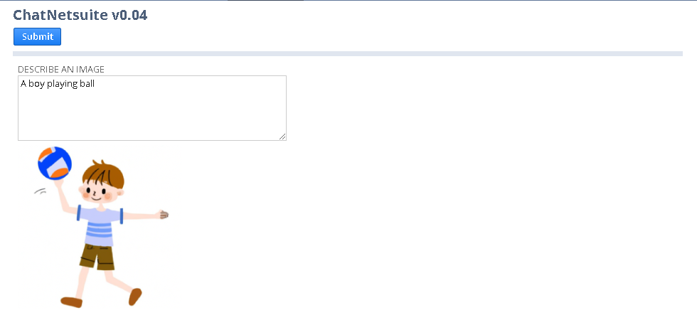

# ChatNetsuite 0.04

A chatbot deployed in **Netsuite**.  
Features include **multi-round conversations** and **image generation**.  

[中文文档](README_sc.md)

## Table of Contents

- [Deployment](#deployment)
- [Maintainers](#maintainers)
- [Contributing](#contributing)
- [Disclaimer](#disclaimer)
- [Changelog](#changelog)

## Deployment

To use ChatNetsuite in NetSuite, you can follow these steps:

1. Upload **chatNetsuite.js** to SuiteScripts folder in the File Cabinet.
2. Go to **Customization > Scripts > New**.
3. Select **ChatNetsuite_public.js** and click on **Create Script Record**.
4. Set the name of the script and click on **Save**.
5. Click on **Deploy Script**.
6. Set script deployment configuration and click on **Save**.
7. Click on the url under the field **URL**.
8. Configure **OPENAI_KEY** in **ChatNetsuite_public.js** file.
9. Alternatively, click on **Edit** and configure **Links** to place ChatNetsuite on the navigation bar.
10. Enjoy.

You can refer to NetSuite's SuiteScript documentation for more detailed information.

## Maintainers

[@karthous](https://github.com/karthous)

## Contributing

PRs accepted.

## Disclaimer

This is not an official product of Oracle, Netsuite, or OpenAI. 
The authors of this project are not responsible for any content generated using this interface.
By using this software, you agree **not** to:

1. Violates any laws.
2. Produces any harm to a person or persons.
3. Disseminates (spreads) any personal information that would be meant for harm.
4. Spreads misinformation.
5. Target vulnerable groups.

## Changelog  

**V0.04 - 17th April 2023:**  
Add image generation.  
Add default prompt to improve the quality of answer and reduce token consumed.  

**V0.03 - 14th April 2023:**  
Support multi-round conversations and temporarily preserve chat history.  
Improve user interface.

**V0.02 - 13th April 2023:**  
Update the model from 'text-davinci-003' to 'gpt-3.5-turbo'.  

