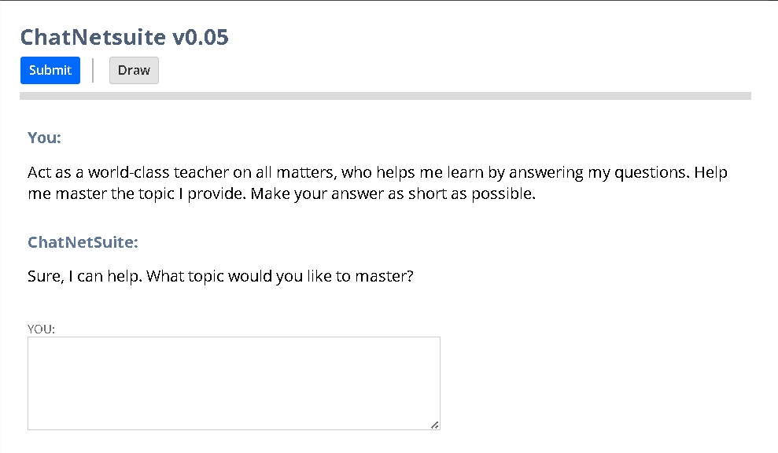

# ChatNetsuite 0.04

ChatNetsuite是一个部署在Netsuite上的聊天机器人，具有**多轮对话**和**生成图片**的功能。  

[English Documentation](README.md)  

## 目录
- [部署说明](#部署说明)
- [维护人员](#维护人员)
- [贡献](#贡献)
- [免责声明](#免责声明)
- [更新日志](#更新日志)

## 部署说明
要在NetSuite中使用ChatNetsuite，您可以按照以下步骤操作：
1. 将ChatNetsuite_public.js和ChatNetsuite_router_public.js上传到文件柜中的SuiteScripts文件夹中。
2. 转到Customization > Scripts > New。
3. 选择ChatNetsuite_public.js并单击Create Script Record。
4. 设置脚本的名称，然后单击Save。
5. 单击Deploy Script。
6. 设置脚本部署配置并单击Save。
7. 单击字段URL下的网址。
8. 在ChatNetsuite_public.js文件中配置OPENAI_KEY。
9. 或者，单击编辑并配置链接，以将ChatNetsuite放置在导航栏上。
10. 玩得开心。  

您可以参考NetSuite的SuiteScript文档以获取更详细的信息。  

## 维护人员
[@karthous](https://github.com/karthous)  

## 贡献
欢迎提交PR。  

## 免责声明
本软件不是Oracle、Netsuite或OpenAI的官方产品。
本项目的作者不对使用本接口生成的任何内容负责。
使用本软件即表示您同意**不**要：
1. 违反任何法律。
2. 对个人或个人造成任何伤害。
3. 传播任何可能造成伤害的个人信息。
4. 传播虚假信息。
5. 针对弱势群体。

## 更新日志

**V0.05 - 2024年3月20日:**  
将图片生成模型更新为 dall-e-3  
改良了导航栏

**V0.04 - 2023年4月17日:**  
增加生成图片功能。  
添加默认提示词以改进回答质量和节约费用。

**V0.03 - 2023年4月14日:**  
支持多轮对话并临时保留聊天记录。  
改进用户界面。

**V0.02 - 2023年4月13日:**  
将模型由 text-davinci-003 更新为 gpt-3.5-turbo

